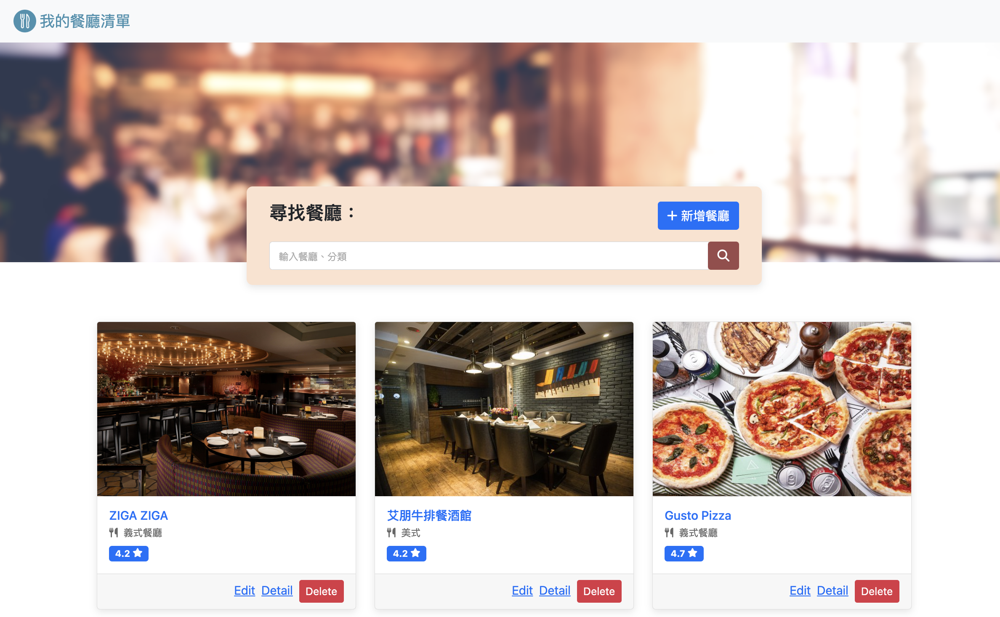

# 餐廳清單 Restaurant List:CRUD 功能  (AC 2-3 A7)


## Screenshot - 畫面截圖



## About - 介紹
這是一個練習使用 Node.js + Express + MongoDB + Mongoose 架構的一個餐廳CRUD網站。

## Features - 功能

1. 使用者可以使用名稱或料理類型來搜尋餐廳
2. 使用者可以新增一家餐廳
3. 使用者可以瀏覽一家餐廳的詳細資訊
4. 使用者可以瀏覽全部所有餐廳
5. 使用者可以修改一家餐廳的資訊
6. 使用者可以刪除一家餐廳

## Prerequisites - 環境建置與需求

* Node.js
* Express "^4.16.4"
* Express-handlebars "^3.1.0"
* Dotenv
* MongoDB
* Mongoose "^6.0.6"

## Installation and execution - 安裝與執行步驟

1.開啟Terminal, Clone此專案至本機:
```
git clone https://github.com/klu0926/Restaurant-List-CRUD.git
```

2.進入存放此專案的資料夾
```
cd restaurant_list_ac
```

3.安裝 npm 套件
```
npm install
```

4.安裝nodemon (如果已經有可跳過)
```
npm install -g nodemon
```

5.安裝express-handlebars
```
npm install express-handlebars@5.3.3
```

6.安裝mongoose
```
npm install mongoose@6.0.6

```

7.使用MongoDB cloud 獲得你的 connection string
```
mongodb+srv://<username>:<password>@<cluster>.pk4dwnp.mongodb.net/?retryWrites=true&w=majority
```

8.安裝dotenv
```
npm install dotenv
```

9.在專案內創造一個.env檔案，並在其輸入你的 MongoDB connection string
```
MONGODB_URL=mongodb+srv://<username>:<password>@<cluster>.pk4dwnp.mongodb.net/?retryWrites=true&w=majority
```

10.製作種子資料 (這會做出8個基本資料，跟啟用新的資料庫)
```
npm run seed
```

11.啟動伺服器 (這會使用 nodemon 啟動專案)
```
npm run dev 
```

12.當 terminal 出現以下字樣，表示伺服器已啟動並成功連結
```
server live on http://localhost:3000
```

13.打開瀏覽器輸入http://localhost:3000 來使用本專案